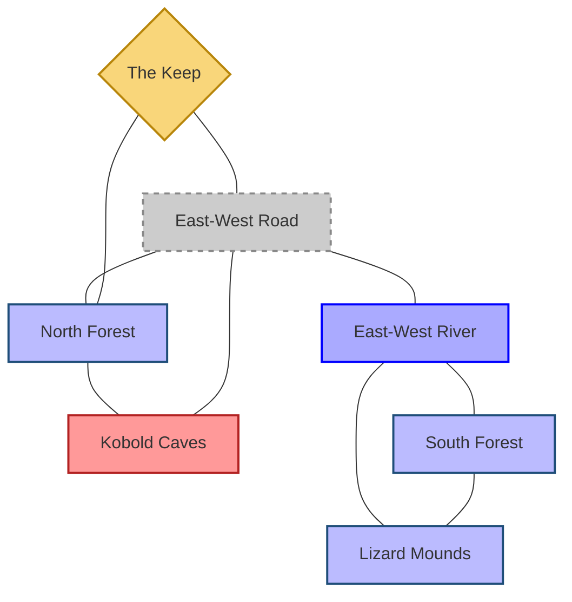
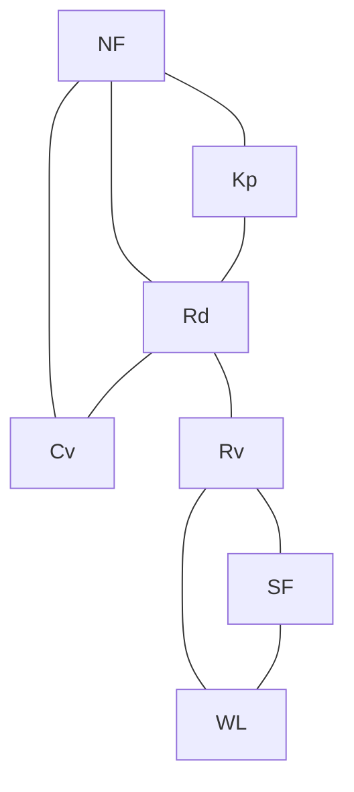

# Welcome to the Moon Fields

```mermaid
%% Nodes
graph TD
%% Nodes
ForestN[North Forest]:::wilderness
Caves[Kobold Caves]:::dungeon
Keep{The Keep}:::settlement
Roads[East-West Road]:::road
River[East-West River]:::river
Wetlands[Lizard Mounds]:::wilderness
ForestS[South Forest]:::wilderness

%% Edges
ForestN --- Caves
Roads --- ForestN
Roads --- River
Roads --- Caves
River --- ForestS
River --- Wetlands
Keep --- ForestN
Keep --- Roads
ForestS --- Wetlands

%% Styles
classDef settlement fill:#f9d67a,stroke:#b8860b,stroke-width:2px;
classDef wilderness fill:#bbf,stroke:#1f4e79,stroke-width:2px;
classDef dungeon fill:#f99,stroke:#b22222,stroke-width:2px;
classDef road fill:#ccc,stroke:#888,stroke-width:2px,stroke-dasharray:5 5;
classDef river fill:#aaf,stroke:#0000ff,stroke-width:2px;
```

```mermaid
graph TD
NF --- Cv
NF --- Kp
NF --- Rd
Kp --- Rd
Rd --- Cv
Rd --- Rv
Rv --- WL
Rv --- SF
SF --- WL
```
